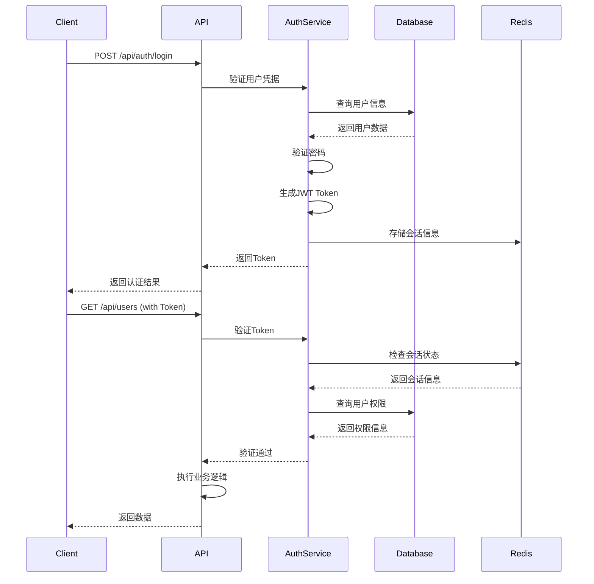

# Node.js 后端项目架构优化实施方案

## 项目概述

基于现有的 Express + TypeScript + Prisma + PostgreSQL + Redis 技术栈，对项目进行全面的架构优化重构，移除现有的车辆监控相关API，重新构建一套完整的用户管理系统，解决当前存在的技术债务和架构问题。

## 优化目标

- ✅ 实现完整的JWT认证授权系统
- ✅ 构建用户管理API接口体系
- ✅ 统一日志系统，移除重复实现
- ✅ 建立监控和健康检查机制
- ✅ 模块化架构重构
- ✅ 提升代码质量和可维护性

---

## 1. 数据模型设计

### 1.1 用户管理系统数据模型

#### Prisma Schema 设计

```prisma
// 用户表
model User {
  id          String   @id @default(cuid())
  email       String   @unique
  username    String   @unique
  password    String   // bcrypt 加密
  firstName   String?
  lastName    String?
  avatar      String?
  isActive    Boolean  @default(true)
  isVerified  Boolean  @default(false)
  lastLoginAt DateTime?
  createdAt   DateTime @default(now())
  updatedAt   DateTime @updatedAt

  // 关系
  userRoles   UserRole[]
  sessions    Session[]
  auditLogs   AuditLog[]

  @@index([email])
  @@index([username])
  @@index([isActive])@@map("users")
}

// 角色表
model Role {
  id          String   @id @default(cuid())
  name        String   @unique
  displayName String
  description String?
  isActive    Boolean  @default(true)
  createdAt   DateTime @default(now())
  updatedAt   DateTime @updatedAt

  // 关系
  userRoles       UserRole[]
  rolePermissions RolePermission[]

  @@map("roles")
}

// 权限表
model Permission {
  id          String   @id @default(cuid())
  name        String   @unique
  resource    String   // 资源名称，如 'users', 'roles'
  action      String   // 操作名称，如 'create', 'read', 'update', 'delete'
  description String?
  createdAt   DateTime @default(now())

  // 关系
  rolePermissions RolePermission[]

  @@unique([resource, action])
  @@map("permissions")
}

// 用户角色关联表
model UserRole {
  id     String @id @default(cuid())
  userId String
  roleId String

  user User @relation(fields: [userId], references: [id], onDelete: Cascade)
  role Role @relation(fields: [roleId], references: [id], onDelete: Cascade)

  @@unique([userId, roleId])
  @@map("user_roles")
}

// 角色权限关联表
model RolePermission {
  id           String @id @default(cuid())
  roleId       String
  permissionId String

  role       Role       @relation(fields: [roleId], references: [id], onDelete: Cascade)
  permission Permission @relation(fields: [permissionId], references: [id], onDelete: Cascade)

  @@unique([roleId, permissionId])
  @@map("role_permissions")
}

// 用户会话表
model Session {
  id           String   @id @default(cuid())
  userId       String
  token        String   @unique
  refreshToken String   @unique
  expiresAt    DateTime
  createdAt    DateTime @default(now())
  updatedAt    DateTime @updatedAt

  user User @relation(fields: [userId], references: [id], onDelete: Cascade)

  @@index([token])
  @@index([refreshToken])
  @@index([expiresAt])
  @@map("sessions")
}

// 审计日志表
model AuditLog {
  id        String   @id @default(cuid())
  userId    String?
  action    String   // 操作类型
  resource  String   // 资源类型
  resourceId String? // 资源ID
  details   Json?    // 详细信息
  ipAddress String?
  userAgent String?
  createdAt DateTime @default(now())

  user User? @relation(fields: [userId], references: [id], onDelete: SetNull)

  @@index([userId])
  @@index([action])
  @@index([resource])
  @@index([createdAt])
  @@map("audit_logs")
}
```

#### SQL 创建脚本

```sql
-- 用户表
CREATE TABLE users (id VARCHAR(30) PRIMARY KEY,
    email VARCHAR(255) UNIQUE NOT NULL,
    username VARCHAR(100) UNIQUE NOT NULL,
    password VARCHAR(255) NOT NULL,
    first_name VARCHAR(100),
    last_name VARCHAR(100),
    avatar VARCHAR(500),
    is_active BOOLEAN DEFAULT true,
    is_verified BOOLEAN DEFAULT false,
    last_login_at TIMESTAMP,
    created_at TIMESTAMP DEFAULT CURRENT_TIMESTAMP,
    updated_at TIMESTAMP DEFAULT CURRENT_TIMESTAMP
);

-- 角色表
CREATE TABLE roles (
    id VARCHAR(30) PRIMARY KEY,
    name VARCHAR(100) UNIQUE NOT NULL,
    display_name VARCHAR(100) NOT NULL,
    description TEXT,
    is_active BOOLEAN DEFAULT true,
    created_at TIMESTAMP DEFAULT CURRENT_TIMESTAMP,
    updated_at TIMESTAMP DEFAULT CURRENT_TIMESTAMP
);

-- 权限表
CREATE TABLE permissions (
    id VARCHAR(30) PRIMARY KEY,
    name VARCHAR(100) UNIQUE NOT NULL,
    resource VARCHAR(100) NOT NULL,
    action VARCHAR(100) NOT NULL,
    description TEXT,
    created_at TIMESTAMP DEFAULT CURRENT_TIMESTAMP,UNIQUE(resource, action)
);

-- 用户角色关联表
CREATE TABLE user_roles (
    id VARCHAR(30) PRIMARY KEY,
    user_id VARCHAR(30) NOT NULL,
    role_id VARCHAR(30) NOT NULL,
    FOREIGN KEY (user_id) REFERENCES users(id) ON DELETE CASCADE,
    FOREIGN KEY (role_id) REFERENCES roles(id) ON DELETE CASCADE,UNIQUE(user_id, role_id)
);

-- 角色权限关联表
CREATE TABLE role_permissions (
    id VARCHAR(30) PRIMARY KEY,
    role_id VARCHAR(30) NOT NULL,
    permission_id VARCHAR(30) NOT NULL,
    FOREIGN KEY (role_id) REFERENCES roles(id) ON DELETE CASCADE,
    FOREIGN KEY (permission_id) REFERENCES permissions(id) ON DELETE CASCADE,
    UNIQUE(role_id, permission_id)
);

-- 用户会话表
CREATE TABLE sessions (
    id VARCHAR(30) PRIMARY KEY,
    user_id VARCHAR(30) NOT NULL,
    token VARCHAR(500) UNIQUE NOT NULL,
    refresh_token VARCHAR(500) UNIQUE NOT NULL,
    expires_at TIMESTAMP NOT NULL,
    created_at TIMESTAMP DEFAULT CURRENT_TIMESTAMP,
    updated_at TIMESTAMP DEFAULT CURRENT_TIMESTAMP,
    FOREIGN KEY (user_id) REFERENCES users(id) ON DELETE CASCADE
);

-- 审计日志表
CREATE TABLE audit_logs (
    id VARCHAR(30) PRIMARY KEY,
    user_id VARCHAR(30),
    action VARCHAR(100) NOT NULL,
    resource VARCHAR(100) NOT NULL,
    resource_id VARCHAR(30),
    details JSONB,
    ip_address INET,
    user_agent TEXT,
    created_at TIMESTAMP DEFAULT CURRENT_TIMESTAMP,
    FOREIGN KEY (user_id) REFERENCES users(id) ON DELETE SET NULL
);

-- 创建索引
CREATE INDEX idx_users_email ON users(email);
CREATE INDEX idx_users_username ON users(username);
CREATE INDEX idx_users_is_active ON users(is_active);
CREATE INDEX idx_sessions_token ON sessions(token);
CREATE INDEX idx_sessions_refresh_token ON sessions(refresh_token);
CREATE INDEX idx_sessions_expires_at ON sessions(expires_at);
CREATE INDEX idx_audit_logs_user_id ON audit_logs(user_id);
CREATE INDEX idx_audit_logs_action ON audit_logs(action);
CREATE INDEX idx_audit_logs_resource ON audit_logs(resource);
CREATE INDEX idx_audit_logs_created_at ON audit_logs(created_at);

-- 插入默认角色和权限
INSERT INTO roles (id, name, display_name, description) VALUES
('role_admin', 'admin', '系统管理员', '拥有系统所有权限'),
('role_user', 'user', '普通用户', '基础用户权限');

INSERT INTO permissions (id, name, resource, action, description) VALUES
('perm_user_create', 'users:create', 'users', 'create', '创建用户'),
('perm_user_read', 'users:read', 'users', 'read', '查看用户'),
('perm_user_update', 'users:update', 'users', 'update', '更新用户'),
('perm_user_delete', 'users:delete', 'users', 'delete', '删除用户'),
('perm_role_create', 'roles:create', 'roles', 'create', '创建角色'),
('perm_role_read', 'roles:read', 'roles', 'read', '查看角色'),
('perm_role_update', 'roles:update', 'roles', 'update', '更新角色'),
('perm_role_delete', 'roles:delete', 'roles', 'delete', '删除角色');

-- 为管理员角色分配所有权限
INSERT INTO role_permissions (id, role_id, permission_id)
SELECT
    'rp_admin_' || permissions.id,
    'role_admin',
    permissions.id
FROM permissions;

-- 为普通用户分配基础权限
INSERT INTO role_permissions (id, role_id, permission_id) VALUES
('rp_user_read', 'role_user', 'perm_user_read');
```

---

## 2. JWT认证授权系统架构

### 2.1 认证流程设计



### 2.2 JWT Token 结构

```typescript
interface JWTPayload {
  sub: string; // 用户ID
  email: string; // 用户邮箱
  username: string; // 用户名
  roles: string[]; // 用户角色
  permissions: string[]; // 用户权限
  iat: number; // 签发时间
  exp: number; // 过期时间jti: string;      // Token ID
}
```

### 2.3 认证中间件设计

```typescript
// JWT认证中间件
export const authenticateJWT = async (req: AuthenticatedRequest, res: Response, next: NextFunction) => {
  try {
    const authHeader = req.headers.authorization;
    const token = authHeader?.startsWith('Bearer ') ? authHeader.substring(7) : null;

    if (!token) {
      return res.status(401).json({
        success: false,
        message: 'Access token required',
      });
    }

    const decoded = jwt.verify(token, env.JWT_SECRET) as JWTPayload;

    // 检查会话是否有效
    const session = await sessionService.validateSession(decoded.jti);
    if (!session) {
      return res.status(401).json({
        success: false,
        message: 'Session expired',
      });
    }

    req.user = decoded;
    next();
  } catch (error) {
    return res.status(401).json({
      success: false,
      message: 'Invalid token',
    });
  }
};

// 权限验证中间件
export const requirePermissions = (permissions: string[]) => {
  return (req: AuthenticatedRequest, res: Response, next: NextFunction) => {
    if (!req.user) {
      return res.status(401).json({
        success: false,
        message: 'Authentication required',
      });
    }

    const hasPermission = permissions.every((permission) => req.user!.permissions.includes(permission));

    if (!hasPermission) {
      return res.status(403).json({
        success: false,
        message: 'Insufficient permissions',
      });
    }

    next();
  };
};
```

---

## 3. API接口体系设计

### 3.1 认证模块 (/api/auth)

#### 3.1.1 用户注册

```
POST /api/auth/register
Content-Type: application/json

{
  "email": "user@example.com",
  "username": "johndoe",
  "password": "SecurePass123!",
  "firstName": "John",
  "lastName": "Doe"
}

Response:
{
  "success": true,
  "message": "User registered successfully",
  "data": {
    "id": "user_123",
    "email": "user@example.com",
    "username": "johndoe",
    "isVerified": false
  }
}
```

#### 3.1.2 用户登录

```
POST /api/auth/login
Content-Type: application/json

{
  "email": "user@example.com",
  "password": "SecurePass123!"
}

Response:
{
  "success": true,
  "message": "Login successful",
  "data": {
    "user": {
      "id": "user_123",
      "email": "user@example.com",
      "username": "johndoe",
      "roles": ["user"]
    },
    "tokens": {
      "accessToken": "eyJhbGciOiJIUzI1NiIs...",
      "refreshToken": "eyJhbGciOiJIUzI1NiIs...",
      "expiresIn": 3600
    }
  }
}
```

#### 3.1.3 刷新Token

```
POST /api/auth/refresh
Content-Type: application/json

{
  "refreshToken": "eyJhbGciOiJIUzI1NiIs..."
}

Response:
{
  "success": true,
  "data": {
    "accessToken": "eyJhbGciOiJIUzI1NiIs...",
    "expiresIn": 3600
  }
}
```

#### 3.1.4 用户登出

```
POST /api/auth/logout
Authorization: Bearer <access_token>

Response:
{
  "success": true,
  "message": "Logout successful"
}
```

### 3.2 用户管理模块 (/api/users)

#### 3.2.1 获取用户列表

```
GET /api/users?page=1&limit=10&search=john
Authorization: Bearer <access_token>

Response:
{
  "success": true,
  "data": {
    "users": [
      {
        "id": "user_123",
        "email": "user@example.com",
        "username": "johndoe",
        "firstName": "John",
        "lastName": "Doe",
        "isActive": true,
        "roles": ["user"],
        "createdAt": "2024-01-01T00:00:00Z"
      }
    ],
    "pagination": {
      "page": 1,
      "limit": 10,
      "total": 1,
      "totalPages": 1
    }
  }
}
```

#### 3.2.2 获取用户详情

```
GET /api/users/:id
Authorization: Bearer <access_token>

Response:
{
  "success": true,
  "data": {
    "id": "user_123",
    "email": "user@example.com",
    "username": "johndoe",
    "firstName": "John",
    "lastName": "Doe",
    "avatar": "https://example.com/avatar.jpg",
    "isActive": true,
    "isVerified": true,
    "roles": ["user"],
    "permissions": ["users:read"],
    "lastLoginAt": "2024-01-01T12:00:00Z",
    "createdAt": "2024-01-01T00:00:00Z"
  }
}
```

#### 3.2.3 更新用户信息

```
PUT /api/users/:id
Authorization: Bearer <access_token>
Content-Type: application/json

{
  "firstName": "John Updated",
  "lastName": "Doe Updated",
  "avatar": "https://example.com/new-avatar.jpg"
}

Response:
{
  "success": true,
  "message": "User updated successfully",
  "data": {
    "id": "user_123",
    "firstName": "John Updated",
    "lastName": "Doe Updated"
  }
}
```

#### 3.2.4 删除用户

```
DELETE /api/users/:id
Authorization: Bearer <access_token>

Response:
{
  "success": true,
  "message": "User deleted successfully"
}
```

### 3.3 角色管理模块 (/api/roles)

#### 3.3.1 获取角色列表

```
GET /api/roles
Authorization: Bearer <access_token>

Response:
{
  "success": true,
  "data": [
    {
      "id": "role_admin",
      "name": "admin",
      "displayName": "系统管理员",
      "description": "拥有系统所有权限",
      "isActive": true,
      "permissions": ["users:create", "users:read", "users:update", "users:delete"]
    }
  ]
}
```

#### 3.3.2 分配用户角色

```
POST /api/users/:userId/roles
Authorization: Bearer <access_token>
Content-Type: application/json

{
  "roleIds": ["role_admin", "role_user"]
}

Response:
{
  "success": true,
  "message": "Roles assigned successfully"
}
```

---

## 4. 统一日志系统设计

### 4.1 日志系统架构

移除现有的重复日志实现（`src/utils/log` 和 `src/utils/pino`），采用统一的日志接口：

```typescript
// src/core/logger/types.ts
export interface ILogger {
  debug(message: string, meta?: LogMeta): void;
  info(message: string, meta?: LogMeta): void;
  warn(message: string, meta?: LogMeta): void;
  error(message: string, error?: Error, meta?: LogMeta): void;
  child(bindings: Record<string, any>): ILogger;
}

export interface LogMeta {
  userId?: string;
  requestId?: string;
  module?: string;
  action?: string;
  [key: string]: any;
}

// src/core/logger/logger.ts
export class UnifiedLogger implements ILogger {
  private pinoLogger: pino.Logger;

  constructor(config: LoggerConfig) {
    this.pinoLogger = pino({
      level: config.level,
      formatters: {
        level: (label) => ({ level: label }),
        log: (object) => ({
          ...object,
          timestamp: new Date().toISOString(),
          service: 'user-management-api',
        }),
      },
      transport: config.pretty
        ? {
            target: 'pino-pretty',
            options: {
              colorize: true,
              translateTime: 'SYS:standard',
              ignore: 'pid,hostname',
            },
          }
        : undefined,
    });
  }

  debug(message: string, meta?: LogMeta): void {
    this.pinoLogger.debug(meta, message);
  }

  info(message: string, meta?: LogMeta): void {
    this.pinoLogger.info(meta, message);
  }

  warn(message: string, meta?: LogMeta): void {
    this.pinoLogger.warn(meta, message);
  }

  error(message: string, error?: Error, meta?: LogMeta): void {
    this.pinoLogger.error({ err: error, ...meta }, message);
  }

  child(bindings: Record<string, any>): ILogger {
    const childLogger = this.pinoLogger.child(bindings);
    return new UnifiedLogger({ level: 'info', pretty: false });
  }
}
```

### 4.2 请求日志中间件

```typescript
// src/middleware/requestLogger.ts
export const requestLogger = (req: Request, res: Response, next: NextFunction) => {
  const requestId = nanoid();
  const startTime = Date.now();

  req.requestId = requestId;

  const logger = getLogger().child({
    requestId,
    method: req.method,
    url: req.url,
    userAgent: req.get('User-Agent'),
    ip: req.ip,
  });

  logger.info('Request started');

  res.on('finish', () => {
    const duration = Date.now() - startTime;
    logger.info('Request completed', {
      statusCode: res.statusCode,
      duration: `${duration}ms`,
    });
  });

  next();
};
```

---

## 5. 监控和健康检查系统

### 5.1 健康检查端点

```typescript
// src/modules/monitoring/controllers/health.controller.ts
export class HealthController {
  async check(req: Request, res: Response) {
    const checks = await Promise.allSettled([
      this.checkDatabase(),
      this.checkRedis(),
      this.checkMemory(),
      this.checkDisk(),
    ]);

    const health = {
      status: 'healthy',
      timestamp: new Date().toISOString(),
      uptime: process.uptime(),
      version: process.env.npm_package_version,
      checks: {
        database: checks[0].status === 'fulfilled' ? checks[0].value : { status: 'unhealthy' },
        redis: checks[1].status === 'fulfilled' ? checks[1].value : { status: 'unhealthy' },
        memory: checks[2].status === 'fulfilled' ? checks[2].value : { status: 'unhealthy' },
        disk: checks[3].status === 'fulfilled' ? checks[3].value : { status: 'unhealthy' },
      },
    };

    const isHealthy = Object.values(health.checks).every((check) => check.status === 'healthy');
    health.status = isHealthy ? 'healthy' : 'unhealthy';

    res.status(isHealthy ? 200 : 503).json(health);
  }

  private async checkDatabase() {
    try {
      await prisma.$queryRaw`SELECT 1`;
      return { status: 'healthy', responseTime: '< 10ms' };
    } catch (error) {
      return { status: 'unhealthy', error: error.message };
    }
  }

  private async checkRedis() {
    try {
      await redis.ping();
      return { status: 'healthy', responseTime: '< 5ms' };
    } catch (error) {
      return { status: 'unhealthy', error: error.message };
    }
  }
}
```

### 5.2 性能指标收集

```typescript
// src/core/metrics/prometheus.ts
import client from 'prom-client';

export const register = new client.Registry();

// HTTP 请求指标
export const httpRequestDuration = new client.Histogram({
  name: 'http_request_duration_seconds',
  help: 'Duration of HTTP requests in seconds',
  labelNames: ['method', 'route', 'status_code'],
  buckets: [0.1, 0.3, 0.5, 0.7, 1, 3, 5, 7, 10],
});

export const httpRequestTotal = new client.Counter({
  name: 'http_requests_total',
  help: 'Total number of HTTP requests',
  labelNames: ['method', 'route', 'status_code'],
});

// 数据库指标
export const dbQueryDuration = new client.Histogram({
  name: 'db_query_duration_seconds',
  help: 'Duration of database queries in seconds',
  labelNames: ['operation', 'table'],
  buckets: [0.001, 0.005, 0.01, 0.05, 0.1, 0.5, 1, 5],
});

// 用户认证指标
export const authAttempts = new client.Counter({
  name: 'auth_attempts_total',
  help: 'Total number of authentication attempts',
  labelNames: ['result'], // 'success' or 'failure'
});

register.registerMetric(httpRequestDuration);
register.registerMetric(httpRequestTotal);
register.registerMetric(dbQueryDuration);
register.registerMetric(authAttempts);
```

---

## 6. 模块化项目结构

### 6.1 新的目录结构

```
src/
├── core/                # 核心基础设施
│   ├── database/                  # 数据库配置
│   ├── cache/                     # 缓存配置
│   ├── logger/                    # 统一日志系统
│   ├── metrics/                   # 性能指标
│   └── config/                    # 配置管理
├── modules/                       # 业务模块
│   ├── auth/                      # 认证模块
│   │   ├── controllers/
│   │   ├── services/
│   │   ├── repositories/
│   │   ├── dtos/
│   │   ├── schemas/
│   │   └── routes.ts
│   ├── users/                     # 用户管理模块
│   │   ├── controllers/
│   │   ├── services/
│   │   ├── repositories/
│   │   ├── dtos/
│   │   ├── schemas/
│   │   └── routes.ts
│   ├── roles/                     # 角色管理模块
│   │   ├── controllers/
│   │   ├── services/
│   │   ├── repositories/
│   │   ├── dtos/
│   │   ├── schemas/
│   │   └── routes.ts
│   └── monitoring/                # 监控模块
│       ├── controllers/
│       ├── services/
│       └── routes.ts
├── shared/                        # 共享组件
│   ├── middleware/                # 中间件
│   ├── utils/                     # 工具函数
│   ├── types/                     # 类型定义
│   ├── constants/                 # 常量
│   └── exceptions/                # 异常处理
├── generated/                     # 生成的代码
│   └── prisma/                    # Prisma 客户端
├── server.ts                      # 服务器入口
└── index.ts                       # 应用入口
```

### 6.2 模块注册机制

```typescript
// src/core/module-registry.ts
export interface Module {
  name: string;
  routes: Router;
  initialize?: () => Promise<void>;
  cleanup?: () => Promise<void>;
}

export class ModuleRegistry {
  private modules: Map<string, Module> = new Map();

  register(module: Module) {
    this.modules.set(module.name, module);
  }

  async initializeAll() {
    for (const module of this.modules.values()) {
      if (module.initialize) {
        await module.initialize();
      }
    }
  }

  getRoutes(): Router[] {
    return Array.from(this.modules.values()).map((module) => module.routes);
  }
}

// src/server.ts
const moduleRegistry = new ModuleRegistry();

// 注册模块
moduleRegistry.register(authModule);
moduleRegistry.register(usersModule);
moduleRegistry.register(rolesModule);
moduleRegistry.register(monitoringModule);

// 初始化模块
await moduleRegistry.initializeAll();

// 注册路由
moduleRegistry.getRoutes().forEach((router) => {
  app.use('/api', router);
});
```

---

## 7. 实施计划

### 7.1 第一阶段：基础架构重构（1-2周）

1. **项目结构重构**
   - 创建新的模块化目录结构
   - 移除现有的 `largeScreen` 相关代码
   - 建立模块注册机制

2. **统一日志系统**
   - 移除重复的日志实现
   - 实现统一的日志接口
   - 更新所有日志调用

3. **数据库模型设计**
   - 更新 Prisma Schema
   - 生成数据库迁移脚本
   - 创建初始数据种子

### 7.2 第二阶段：认证授权系统（2-3周）

1. **JWT认证系统**
   - 实现JWT生成和验证
   - 创建认证中间件
   - 实现会话管理

2. **权限控制系统**
   - 实现RBAC权限模型
   - 创建权限验证中间件
   - 实现权限检查逻辑

3. **认证API接口**
   - 用户注册/登录接口
   - Token刷新接口
   - 用户登出接口

### 7.3 第三阶段：用户管理系统（2-3周）

1. **用户管理API**
   - 用户CRUD接口
   - 用户搜索和分页
   - 用户状态管理

2. **角色管理API**
   - 角色CRUD接口
   - 权限分配接口
   - 用户角色管理

3. **审计日志系统**
   - 操作日志记录
   - 日志查询接口
   - 安全审计功能

### 7.4 第四阶段：监控和优化（1-2周）

1. **监控系统**
   - 健康检查端点
   - 性能指标收集
   - 监控仪表板

2. **性能优化**
   - 数据库查询优化
   - 缓存策略实现
   - 接口性能调优

3. **测试和文档**
   - 单元测试编写
   - 集成测试完善
   - API文档更新

---

## 8. 技术要求

### 8.1 依赖包更新

```json
{
  "dependencies": {
    "@prisma/client": "^7.0.1",
    "bcryptjs": "^2.4.3",
    "jsonwebtoken": "^9.0.2",
    "prom-client": "^15.1.0",
    "express-rate-limit": "^8.2.1",
    "helmet": "^8.1.0",
    "cors": "^2.8.5",
    "zod": "^4.1.13",
    "nanoid": "^5.1.6",
    "dayjs": "^1.11.19"
  },
  "devDependencies": {
    "@types/bcryptjs": "^2.4.6",
    "@types/jsonwebtoken": "^9.0.5"
  }
}
```

### 8.2 环境变量配置

```bash
# JWT配置
JWT_SECRET=your-super-secret-jwt-key-min-32-chars
JWT_EXPIRES_IN=1h
JWT_REFRESH_EXPIRES_IN=7d

# 密码加密
BCRYPT_ROUNDS=12

# 会话配置
SESSION_TIMEOUT=3600

# 监控配置
METRICS_ENABLED=true
HEALTH_CHECK_ENABLED=true
```

---

## 9. 验收标准

### 9.1 功能验收

- ✅ 用户注册、登录、登出功能正常
- ✅ JWT Token 生成和验证正确
- ✅ 权限控制系统工作正常
- ✅ 用户管理CRUD操作完整
- ✅ 角色权限分配功能正常
- ✅ 审计日志记录完整

### 9.2 性能验收

- ✅ API响应时间 < 200ms (P95)
- ✅ 数据库查询时间 < 100ms (P95)
- ✅ 系统可用性 > 99.9%
- ✅ 并发用户支持 > 1000

### 9.3 安全验收

- ✅ 密码安全加密存储
- ✅ JWT Token 安全验证
- ✅ API接口权限保护
- ✅ 输入数据验证完整
- ✅ 安全审计日志记录

---

## 10. 风险评估与应对

### 10.1 技术风险

**风险**: 大规模重构可能影响系统稳定性
**应对**: 采用渐进式重构，保持向后兼容

**风险**: 新的认证系统可能存在安全漏洞
**应对**: 使用成熟的JWT库，进行安全测试

### 10.2 进度风险

**风险**: 开发时间可能超出预期
**应对**: 分阶段实施，优先核心功能

**风险**: 团队对新架构不熟悉
**应对**: 提供详细文档和培训

---

## 结论

本架构优化方案将彻底解决现有项目的技术债务，建立一个现代化、可扩展、高性能的用户管理系统。通过模块化设计、统一日志系统、完善的认证授权机制和监控体系，为项目的长期发展奠定坚实基础。

实施过程中需要严格按照计划执行，确保每个阶段的质量和进度，最终交付一个企业级的后端系统。
