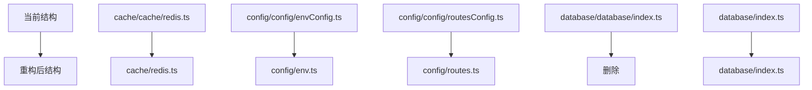

# Express项目重构实施方案

## 🎯 重构目标与策略

基于代码分析报告，本方案将按照 **依赖修复 → 死代码清理 → 架构重构 → 质量提升** 的顺序进行系统性重构。

## 📋 重构流程图

```mermaid
graph TD
    A[开始重构] --> B[阶段1: 依赖引用修复]
    B --> C[修复@/config路径错误]
    C --> D[修复@/utils/pino路径错误]
    D --> E[修复@/cache/redis路径错误]
    E --> F[修复@/database路径错误]
    F --> G[验证编译通过]
    G --> H{编译是否成功?}
    H -->|否| I[修复编译错误]
    I --> G
    H -->|是| J[阶段2: 死代码清理]

    J --> K[删除空目录]
    K --> L[删除重复文件]
    L --> M[清理未使用导入]
    M --> N[阶段3: 架构重构]

    N --> O[重构core/cache目录]
    O --> P[重构core/config目录]
    P --> Q[重构core/database目录]
    Q --> R[创建统一入口文件]
    R --> S[阶段4: 代码质量提升]

    S --> T[统一导入方式]
    T --> U[优化命名规范]
    U --> V[完善文档注释]
    V --> W[最终验证测试]
    W --> X[重构完成]
```

## 🔧 阶段1: 依赖引用修复

### 1.1 路径映射错误修复清单

| 序号 | 文件路径 | 错误引用 | 正确引用 | 状态 |
|------|---------|---------|---------|------|
| 1 | `src/core/cache/cache/redis.ts` | `@/config/envConfig` | `@/core/config/config/envConfig` | ⏳ |
| 2 | `src/core/cache/cache/redis.ts` | `@/utils/pino` | `@/core/logger/pino` | ⏳ |
| 3 | `src/core/logger/pino/config.ts` | `@/config/envConfig` | `@/core/config/config/envConfig` | ⏳ |
| 4 | `src/shared/middleware/middleware/errorHandler.ts` | `@/config/envConfig` | `@/core/config/config/envConfig` | ⏳ |
| 5 | `src/shared/middleware/middleware/rateLimiter.ts` | `@/config/envConfig` | `@/core/config/config/envConfig` | ⏳ |
| 6 | `src/shared/middleware/middleware/requestLogger.ts` | `@/config/envConfig` | `@/core/config/config/envConfig` | ⏳ |
| 7 | `src/shared/middleware/middleware/security.ts` | `@/utils/pino` | `@/core/logger/pino` | ⏳ |
| 8 | `src/shared/middleware/middleware/metrics.ts` | `@/utils/pino` | `@/core/logger/pino` | ⏳ |
| 9 | `src/shared/utils/routeRegistry.ts` | `@/config/envConfig` | `@/core/config/config/envConfig` | ⏳ |
| 10 | `src/modules/monitoring/healthCheck/healthCheck.routes.ts` | `@/cache/redis` | `@/core/cache/cache/redis` | ⏳ |

### 1.2 修复操作步骤

```bash
# 步骤1: 批量查找和替换路径引用
# 使用IDE的全局查找替换功能或命令行工具

# 替换 @/config/envConfig -> @/core/config/config/envConfig
find src -name "*.ts" -exec sed -i 's|@/config/envConfig|@/core/config/config/envConfig|g' {} \;

# 替换 @/utils/pino -> @/core/logger/pino
find src -name "*.ts" -exec sed -i 's|@/utils/pino|@/core/logger/pino|g' {} \;

# 替换 @/cache/redis -> @/core/cache/cache/redis
find src -name "*.ts" -exec sed -i 's|@/cache/redis|@/core/cache/cache/redis|g' {} \;

# 替换 @/database -> @/core/database
find src -name "*.ts" -exec sed -i 's|@/database|@/core/database|g' {} \;
```

### 1.3 验证步骤

```bash
# 编译检查
npm run build
# 或
pnpm build

# 类型检查
npx tsc --noEmit
```

## 🧹 阶段2: 死代码清理

### 2.1 空目录清理


**需要删除的空目录:**

```bash
# 删除空目录
rm -rf src/core/metrics/
rm -rf src/modules/roles/controllers/
rm -rf src/modules/roles/dtos/
rm -rf src/modules/roles/repositories/
rm -rf src/modules/roles/schemas/
rm -rf src/modules/roles/services/
rm -rf src/modules/monitoring/controllers/
rm -rf src/modules/monitoring/dtos/
rm -rf src/modules/monitoring/repositories/
rm -rf src/modules/monitoring/schemas/
rm -rf src/modules/monitoring/services/
```

### 2.2 重复文件处理

**重复文件分析:**

- `src/core/database/index.ts` (保留)
- `src/core/database/database/index.ts` (删除)

**操作步骤:**

```bash
# 1. 备份重复文件内容
cp src/core/database/database/index.ts src/core/database/database/index.ts.backup

# 2. 检查引用该文件的地方
grep -r "database/database" src/

# 3. 更新引用路径
# 将 @/core/database/database 替换为 @/core/database

# 4. 删除重复文件
rm -rf src/core/database/database/
```

## 🏗️ 阶段3: 架构重构

### 3.1 目录结构重组



### 3.2 具体重构步骤

#### 3.2.1 重构cache目录

```bash
# 1. 创建新的目录结构
mkdir -p src/core/cache/

# 2. 移动文件
mv src/core/cache/cache/redis.ts src/core/cache/redis.ts

# 3. 创建统一入口
cat > src/core/cache/index.ts << 'EOF'
/**
 * 缓存模块统一导出
 */
export { cacheService } from './redis';
EOF

# 4. 删除旧目录
rm -rf src/core/cache/cache/

# 5. 更新所有引用
find src -name "*.ts" -exec sed -i 's|@/core/cache/cache/redis|@/core/cache/redis|g' {} \;
```

#### 3.2.2 重构config目录

```bash
# 1. 移动配置文件
mv src/core/config/config/envConfig.ts src/core/config/env.ts
mv src/core/config/config/routesConfig.ts src/core/config/routes.ts

# 2. 创建统一入口
cat > src/core/config/index.ts << 'EOF'
/**
 * 配置模块统一导出
 */
export { env } from './env';
export { default as setupRoutes } from './routes';
EOF

# 3. 删除旧目录
rm -rf src/core/config/config/

# 4. 更新所有引用
find src -name "*.ts" -exec sed -i 's|@/core/config/config/envConfig|@/core/config/env|g' {} \;
find src -name "*.ts" -exec sed -i 's|@/core/config/config/routesConfig|@/core/config/routes|g' {} \;
```

#### 3.2.3 创建Core模块统一入口

```typescript
// src/core/index.ts
/**
 * Core模块统一入口
 * 提供项目核心功能的统一导出
 */

// 缓存模块
export * from './cache';

// 配置模块
export * from './config';

// 数据库模块
export * from './database';

// 日志模块
export * from './logger';
```

### 3.3 更新导入路径

**重构后的导入方式:**

```typescript
// 重构前
import { env } from '@/core/config/config/envConfig';
import { cacheService } from '@/core/cache/cache/redis';
import { prisma } from '@/core/database';

// 重构后 - 方式1: 直接导入
import { env } from '@/core/config/env';
import { cacheService } from '@/core/cache/redis';
import { prisma } from '@/core/database';

// 重构后 - 方式2: 统一入口导入
import { env, cacheService, prisma } from '@/core';
```

## ✨ 阶段4: 代码质量提升

### 4.1 统一导入方式

**导入规范:**

1. 优先使用绝对路径 (`@/`) 而非相对路径
2. 按照以下顺序组织导入:
   - Node.js内置模块
   - 第三方库
   - 项目内部模块 (按字母顺序)

**示例:**

```typescript
// ✅ 推荐的导入顺序
import fs from 'fs';
import path from 'path';

import express from 'express';
import bcrypt from 'bcryptjs';

import { env } from '@/core/config';
import { logger } from '@/core/logger';
import { prisma } from '@/core/database';
```

### 4.2 命名规范优化

| 类型 | 规范 | 示例 |
|------|------|------|
| 文件名 | kebab-case | `user-service.ts` |
| 目录名 | kebab-case | `auth-middleware` |
| 类名 | PascalCase | `UserService` |
| 函数名 | camelCase | `getUserById` |
| 常量 | UPPER_SNAKE_CASE | `MAX_RETRY_COUNT` |

## 📊 验证与测试

### 验证清单


**验证命令:**

```bash
# 1. TypeScript编译检查
npx tsc --noEmit

# 2. ESLint检查
npm run lint

# 3. 运行测试
npm test

# 4. 构建项目
npm run build

# 5. 启动项目
npm start
```

## 🚀 实施时间表

| 阶段 | 预计时间 | 关键里程碑 |
|------|---------|-----------|
| 阶段1: 依赖修复 | 4小时 | 所有编译错误解决 |
| 阶段2: 死代码清理 | 2小时 | 冗余代码清理完成 |
| 阶段3: 架构重构 | 6小时 | 目录结构优化完成 |
| 阶段4: 质量提升 | 4小时 | 代码规范统一 |
| **总计** | **16小时** | **重构全面完成** |

## ⚠️ 风险控制

### 回滚策略

1. 每个阶段完成后创建Git提交点
2. 保留重要文件的备份
3. 记录所有修改的文件路径

### 测试策略

1. 每个阶段完成后运行完整测试套件
2. 重点测试核心功能模块
3. 验证API接口正常工作

---

**方案制定时间**: 2025-12-03
**预计完成时间**: 2-3个工作日
**负责人**: 代码重构专家团队
